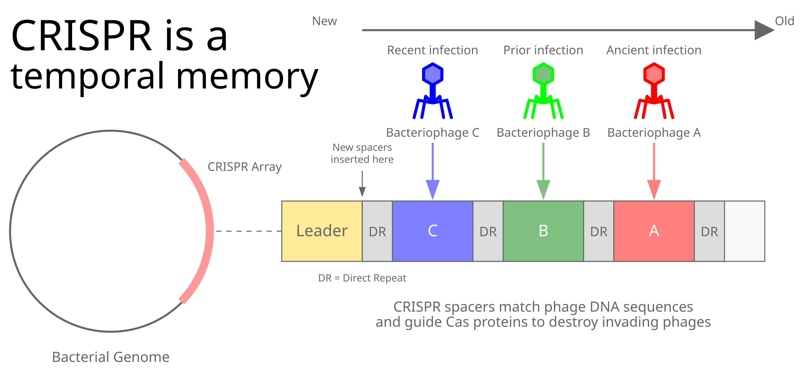

# What CRISPR, o3, and the Memphis Plume Show Us About Intelligence

TL;DR: universal intelligence—the ability to solve any problem—depends on the ability to be true to yourself while remembering what you've thought, and nothing else.

*This post provides an accessible introduction to our recent paper [Memory makes computation universal, remember? (arXiv:2412.17794)](https://arxiv.org/abs/2412.17794), which formally proves the TL;DR.*

- [The Memphis Plume](#the-memphis-plume) - the race for artificial general intelligence made visible
- [Universal Computation](#universal-computation) - human + pen + paper + sandwiches = universal computer
- [Memory Makes Computation Universal](#memory-requirement) - two rules for general intelligence
- [The Bitter Pill](#bitter-pill) - why making transformers think longer will hit a wall
- [Nature's Solution](#natures-solution) - learning from biological memory
- [Beyond Brute Force](#beyond-brute-force) - what o3 reveals
- [A Path Forward](#path-forward) - remembering efficiently

---

## <a name="the-memphis-plume" href="#the-memphis-plume">The Memphis Plume</a>

On a crisp morning in early December 2024, I was running by the Mississippi when I noticed a plume on the horizon:

At first, I thought it was [xAI's "Colossus" supercomputer](https://en.wikipedia.org/wiki/Colossus_(supercomputer)).
However, the plume is mostly from the Tennessee Valley Authority's Allen Combined Cycle Plant—a [1.1-gigawatt natural gas power plant powering Memphis](https://en.wikipedia.org/wiki/Allen_Combined_Cycle_Plant), which sits on the same site.
Nevertheless, let's take it as a vision of the future that lies on our current development path.

With 100,000 Nvidia H100 GPUs, xAI is believed to be the world's largest AI supercomputer.
It's already drawing around 150 MW and substantial cooling water.
For now, that's only a fraction of Allen's power footprint, but [xAI's plans call for scaling to a gigawatt in the coming year](https://www.cleanenergy.org/blog/will-memphis-pay-a-price-for-elon-musks-xai-colossus-bait-switch/)—potentially creating its own towering plume of the same scale in the race toward artificial general intelligence.

This growing industrial footprint, now dominating Memphis's skyline, foreshadows compute's heat waste made visible in our rush to train an artificial general intelligence (AGI).
[xAI's stated goal is a "1% shot at a Kardashev type 1 civilization"](https://www.capacitymedia.com/article/musks-xais-colossus-cluster-set-for-one-million-gpu-supercomputer-expansion)—a [society capable of harnessing all its planet's energy](https://en.wikipedia.org/wiki/Planetary_civilization), presumably enabled by the AGI they aim to bring into the world.
And they're just getting started, with a tenfold [expansion of Colossus to 1M GPUs](https://www.ft.com/content/9c0516cf-dd12-4665-aa22-712de854fe2f) already planned.

## <a name="universal-computation" href="#universal-computation">Universal Computation</a>

You may have noticed that, although ravenous and hyperactive, a human child doesn't generate a thousand meter plume of water vapor and reactive particulates to develop their intelligence.
Yet your average human, fueled by sandwiches, can implement any algorithm with just pen and paper.
So augmented with bronze age technology, we become ["universal" computers in Turing's language](https://doi.org/10.1112/plms/s2-42.1.230)—the quintessential "general" intelligence capable of solving any problem given enough time and snacks.
For the sake of argument, let’s agree: general intelligence ≈ universal computer.

That link has been on my mind for two years, ever since I first read the magic words "Let’s think step by step" in a groundbreaking machine learning paper.
I was amused by how a simple phrase, [first introduced in "Large Language Models are Zero-Shot Reasoners"](https://arxiv.org/abs/2205.11916), seemed to invoke a more deliberate, thoughtful mode in large language models (LLMs).
It was as if some [psychological effect](https://en.wikipedia.org/wiki/List_of_psychological_effects) flipped them into a more rigorous and structured part of their state space, leading to dramatic improvement in performance, and encouraging the world's LLM whisperers to add this incantation to every time they saw models faltering.

But theoretical analyses of transformers revealed something deeper than just a neat psychology trick.
[Transformers, in a single forward pass, are restricted to a computational class called TC0](https://arxiv.org/abs/2310.07923), basically a family of threshold circuits that can be computed in parallel with aggregation.
TC0 systems are often called "bounded parallel".
They can quickly match patterns, but can't count, do math, or follow a recipe unless the process can be encoded in a fixed set of circuits.
_However_, if you use "chain-of-thought" or a series of recursive prompts—feeding each of the model's outputs back into its input—[the combined system becomes capable of simulating a universal Turing machine](https://arxiv.org/abs/2305.15408).
The model’s expressivity, harnessed across multiple steps, blossoms into general computation.

## <a name="memory-requirement" href="#memory-requirement">Memory Makes Computation Universal</a>

Out of deep love for this line of research, I spent much of December in [a meditation on the link between memory and computation](https://arxiv.org/abs/2412.17794).
There and in this post, I provide the simplest and most intuitive explanation of universality (a.k.a. general intelligence) that I could synthesize:

*Universality requires only (1) stable evolution of thought (no hallucinations), and (2) reliable access to the history of thought.*

This synthesis rightly seems banal, dull, too simple to be useful, too theory of computation 101 to be interesting.
And OK, if you studied the theory of computation, yes, it is, but why did y'all forget the textbook and start imaging that threshold circuits and feedforward networks could achieve general intelligence?
If you can remember, this perspective quickly takes us to some amazing places.

The first place is an intuitive understanding of what LLMs are.
[Machine learning got excited by the observation that adding more parameters and training tokens could yield "scaling laws" that took us to a place where intelligence "emerged"](https://arxiv.org/abs/2203.15556).
Another interpretation is that LLMs are a quintessential example of transfer learning, where humans and our society is the model that's being transferred.
By trying to predict what humans might say or do next, the models effectively learned patterns embedded in our writing—including the latent computational rules that shape human reasoning.
They're not just modeling words but the programs behind those words (which might be human minds, or other models, or entire cryptographic protocols).
Looking through the lens of Turing machines, we've transferred our state transition functions to them, which they are now they are able to generalize to new input contexts ([drawing tikz unicorns and such](https://arxiv.org/abs/2303.12712)).
This deeper transfer of computational thinking [explains why models continue improving far beyond naive pattern-matching saturation points](https://ai.meta.com/blog/meta-llama-3/) ([technical paper](https://arxiv.org/abs/2407.21783))—they're gradually refining their models of human cognitive processes themselves.

Part of the magic is that LLMs, most of which are Transformers, are forging a shared computational interface with us, letting us push each other around in a collaborative workspace space that can solve new tasks.

## <a name="bitter-pill" href="#bitter-pill">The Bitter Pill</a>

However, they have a costly flaw that makes them otherworldly in their resource demands: attention.
In effect, attention is a learned function for memory and association across the input.
But with *n* tokens, each must attend to every other token—an *n* × *n* explosion in both compute and memory.
Double your context length, quadruple the cost.
Want to "think" four times longer?
That's sixteen times more overhead.
And because memory is the key to intelligence, model context length must be increased, leading to quadratic increases in costs.
Attention demonstrates [the bitter lesson](http://www.incompleteideas.net/IncIdeas/BitterLesson.html): end-to-end learning beats architecture, but it also forces us to eat a *bitter pill*: a quadratic cost that we can't scale forever.
A transformer's quadratic scaling hits a wall from 100k to 1M tokens.
It's no coincidence that this is precisely the range of maximum context lengths seen in current frontier models.

## <a name="natures-solution" href="#natures-solution">Nature's Solution</a>

But the truth is, generality doesn’t require a quadratic cost.
Look at a single cell.
It has gigabases of DNA and a swarm of biomolecules, operating in a parallel soup with no centralizing control.
By some definitions, each cell’s molecular interactions also fall in that threshold-circuit-like class: essentially parallel transformations, no large sequential pipeline.
But cells offset this limitation with state—encoded in their components and their DNA, which holds a record of life’s entire lineage.
When cells need to store or recall specific bits of information, they literally write it into the genome.
The canonical example is [CRISPR](https://en.wikipedia.org/wiki/CRISPR).
At its core, CRISPR functions as a chronological log of viral fragments—essentially addresses in DNA space.
These fragments represent viral infections that both the individual cell and its ancestral lineage have survived.
The chronology is not just an artifact of the system, but is essential because by remembering which viruses are more recent, the cell can invest more energy in making guided nucleases that target them than ones which occurred long ago.

The ARC AGI Prize nicely illustrates where today’s models stand.
A single forward-pass language model—like GPT-4—gets about 0–5% accuracy on ARC tasks.
Cheaper chain-of-thought–based systems that do a bit of [test-time training](https://arxiv.org/abs/2411.07279) [get close to 50%](https://arxiv.org/abs/2412.04604).
Meanwhile, a careful human solver will approach 100% if you just give them enough time to think.

## <a name="beyond-brute-force" href="#beyond-brute-force">Beyond Brute Force</a>

Then, in late December 2024, along comes [OpenAI's o3](https://openai.com/index/deliberative-alignment/), which [nearly solved the entire benchmark](https://arcprize.org/blog/oai-o3-pub-breakthrough).
If you let the model "think less"—what they call high-efficiency mode—it answers 400 tasks at 82.8% accuracy for around $6,600.
But if you let it think 172 times longer, exploring many more possible solution paths in parallel, it climbs to 91.5%.
That final push costs an estimated $1.15 million (≈ 172 × $6.6k) in total compute.
[o3's authors describe this not primarily as an engineering hack but as an ethical one](https://openai.com/index/deliberative-alignment/), "deliberative alignment" wherein an overseer system that maintains the alignment of an kind of "forest of thought", [MCMC](https://en.wikipedia.org/wiki/Markov_chain_Monte_Carlo) sampled chains-of-thought which are kept in check.
Their published numbers suggest that they pay a monstrous cost to keep all those partial reasoning traces in memory, to preserve consistency, and let the model think longer in pursuit of another apparent scaling law.

In effect, by brute-forcing memory into reliability, they show how easily you can approach universal computation if you're willing to burn a fortune on tokens.
And this isn't like previous scaling laws that revealed new capabilities—it's paying an enormous price to achieve something that biological systems do routinely.
To reach the kind of sustained reliable thinking needed for real breakthroughs—novel cancer treatments, scientific discoveries, fundamental insights—we'd need to maintain computational state not just for a few more steps, but across weeks or months of focused investigation.
Not just in one mind, but across communities of thinkers building on each other's work.
At quadratic cost, that's not just unsustainable it's impossible.

Meanwhile, human civilization achieves this kind of extended cognition through more elegant means.
Ideas evolve across conversations, papers, and experiments, maintaining state through distributed networks of sandwich-powered minds working in shared contexts.

Current AI research has thus discovered that "thinking longer" helps, but in their excitement over this empirical finding, many miss that reliable memory is the fundamental capability that makes computation universal.
The field has [embraced psychological concepts like Daniel Kahneman "System 1" (fast, intuitive) versus "System 2" (slow, deliberate) thinking to explain these improvements](https://www.youtube.com/watch?v=jPluSXJpdrA).
o1/o3's developers advocate [dramatically scaling test-time compute](https://www.youtube.com/watch?v=eaAonE58sLU) to "hours, days, even weeks", but I truly wonder how quadratic-memory transformer-based architectures will allow this to happen.

Soon after [o3's release](https://openai.com/index/deliberative-alignment/), OpenAI's Board said that to achieve AGI, we'll just need ([as paraphrased](https://daringfireball.net/2024/12/openai_unimaginable)) "unimaginable sums of money", [proposing to restructure as a public benefit corporation to attract fresh capital](https://openai.com/index/why-our-structure-must-evolve-to-advance-our-mission/).
They plan to scale up, spin more GPUs, and chase universal intelligence through raw power.

. This work is close to my heart: I'm originally from Kentucky, where the [Vesivius Challenge](https://scrollprize.org/grandprize) that led to this breakthrough is organized. I also spent nearly a decade living in Napoli, and have visited Ercolano scavi (Herculaneum) many times. Copyright Vesuvius Challenge.](youssef_text_wbb.small.jpg)

## <a name="path-forward" href="#path-forward">A Path Forward</a>

As a sandwich-eating universal intelligence, I'm not convinced.
Humans got smarter not by growing our brains, but by distributing memory across society—spoken word, libraries, the internet—finding ways to preserve and share knowledge without a ruinous overhead.
I'll bet on a resurgence of [recurrent approaches](https://arxiv.org/abs/2410.01201) that drastically reduce inference costs by maintaining a [rolling hidden state, incrementally processing new information, thinking slowly and deeply when we need them to](https://arxiv.org/abs/2412.06769).
Yes, we might need specialized modules for robust memory access—but if biology, evolution, and a good pen-and-paper can do it, so can we.
Generality doesn't require industrial-scale cooling towers and power plants.
It just needs a reliable way to remember and recall what you've thought.

Let's remember.
